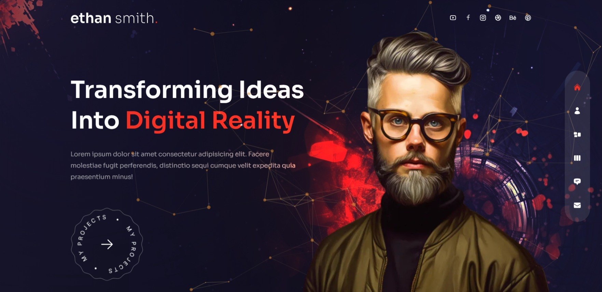
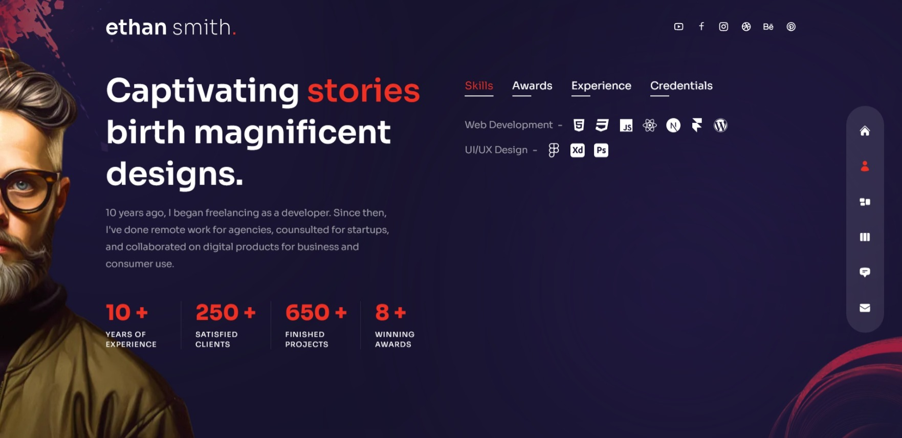
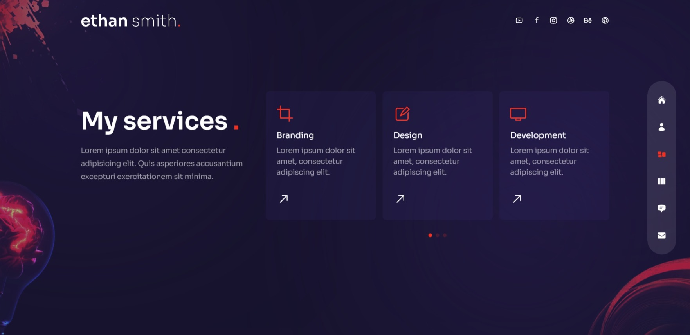
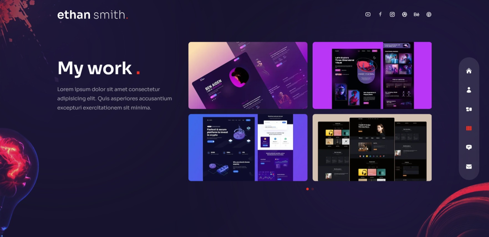
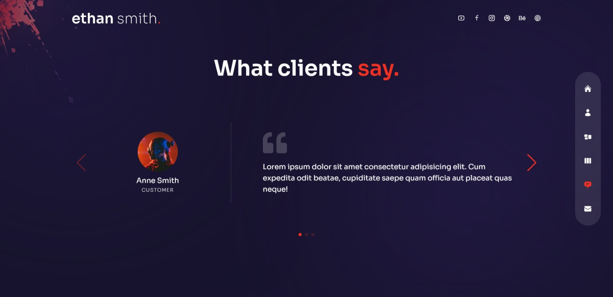
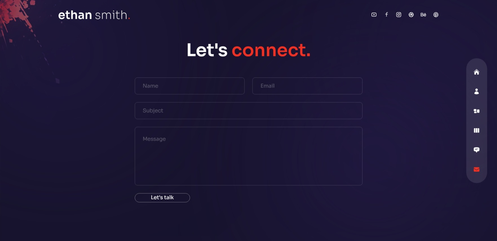

# React Portfolio 02
This design is inspired by the work of [Cristian Mihai](https://www.youtube.com/@cristianmihai01). Click [here](https://youtu.be/qp0-L_M3Ad4?si=g9PJVw2dllqv2w8Z) to watch the video.

## Technologies
This web page was made with the following technologies:
- HTML5
- CSS3
- JavaScript
- React
- Next
- Framer Motion
- React Countup
- React DOM
- React Icons
- React tsParticles
- Swiper
- Tailwind CSS

## Pages
This project contains 6 sections: **Home**, **About**, **Services**, **Work**, **Testimonials** and **Contact**.

### Home
#### In that home section, there is a title and description of the web page, and to the right of it an image. On the right side there is a navigation bar that will take you to different sections of the website. And at the top right you will find the social networks.

 
### About
#### In that other section, you will see a title and a description. Below that you will see information such as years of experience, number of satisfied clients, completed projects, and awards won. On the right, you will see skills, awards, experience and credentials.

### Services
#### In this services section, there is a title and a short description. And on the right side the services offered to the client.

### Work
#### In this other section, you will see a title and a short description. Additionally, on the right side you will see the completed projects.

### Testimonials
#### In this section, you will see testimonials from satisfied customers.

### Contact
#### In this other section, you will see a form which you can fill out to send a message and get in touch.

