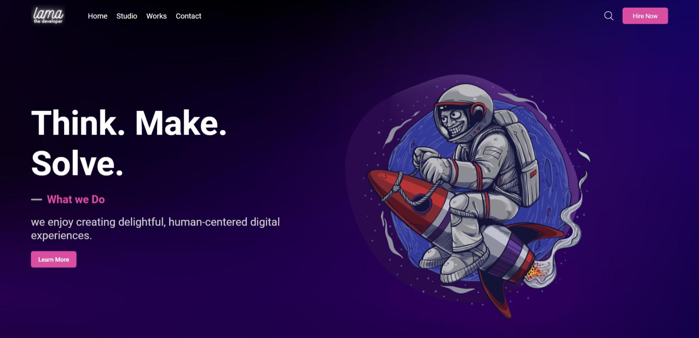
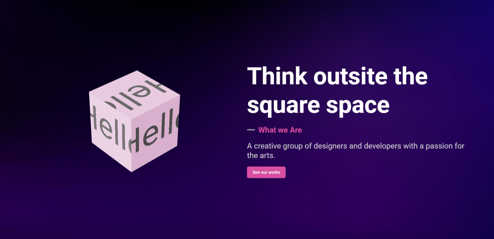
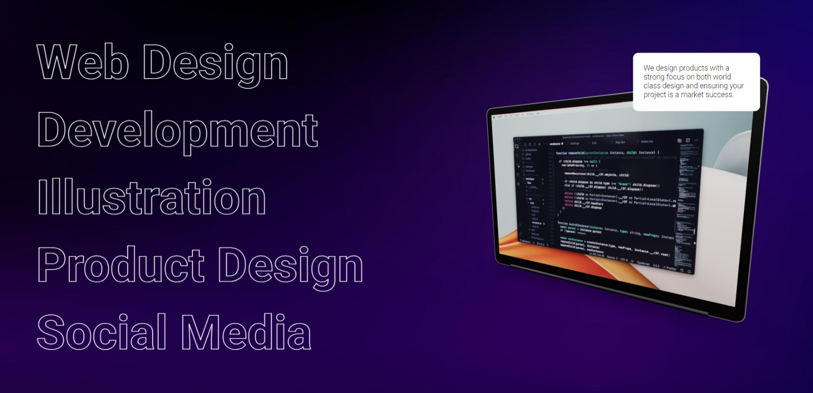
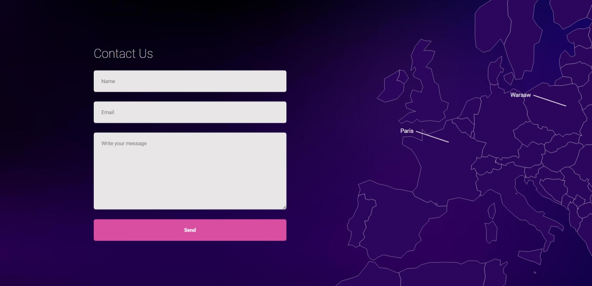

# React Portfolio 02
This design is inspired by this [video](https://youtu.be/qALsVa-V9qo), which belongs to [Lama Dev](https://www.youtube.com/@LamaDev).

## Technologies
This web page was made with the following technologies:
- HTML5
- CSS3
- JavaScript
- React (useState, useRef, useMemo)
- Three.js
- Styled Components
- React Simple Maps

## Pages
This web page contains 7 sections: **Hero**, **Who**, **Works** and **Contact**.

### Hero
#### In this section you will see the title of the web page, a subtitle, a short description and a button. And on the right side an image and behind a bubble made with Three.js.

### Who
#### In this section, you will see the section title, a subtitle, a short description, and a button. And on the left side a cube made with Three.js.

### Works
#### In this section you will see a list of services that are offered. If you click on one, on the right side you will see a figure made with Three.js.

### Contact
#### In this section you will see a form that will help you contact us, although it is not functional. On the right hand side you will see a map made with React Simple Maps.

